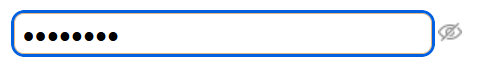

# ✨ Travel Planner – Sign Up Form

This is a simple and responsive **Sign Up Form** built for the Travel Planner web application. It includes live password validation, accessibility-friendly design, and a password visibility toggle.

---

## 🔍 Features

- Clean, minimal UI
- Responsive layout using Flexbox
- Live password pattern validation with check marks
- Password visibility toggle button
- Accessible with semantic HTML and ARIA labels

---

## 🖼️ UI

### Sign Up Form


---

## ⚙️ Functionality

### ✅ Password Pattern Checks


The form checks the password input for the following criteria in real-time:

- 8–15 characters
- At least one uppercase letter (`A–Z`)
- At least one lowercase letter (`a–z`)
- At least one number (`0–9`)
- At least one special character (`?!@#$%^&*`)

When the pattern is matched, a ✅ checkmark appears next to the corresponding rule.

```js
passwordInput.addEventListener("input", function () {
  const { value, vLength } = updatedInput();

  if (vLength <= 0) {
    viewBtn.innerHTML = ``;
    passwordInput.type = "password";
  }
  //check length
  if (vLength >= 8 && vLength <= 15) {
    checkElements.length.innerText = "✅";
  } else {
    checkElements.length.innerText = "";
  }

  //check contain patterns in the input value
  function checkChar(pattern) {
    return pattern.test(value);
  }

  //check upperCase
  if (checkChar(/[A-Z]/)) {
    checkElements.upperCase.innerText = "✅";
  } else {
    checkElements.upperCase.innerText = "";
  }

  //check lowerCase
  if (checkChar(/[a-z]/)) {
    checkElements.lowerCase.innerText = "✅";
  } else {
    checkElements.lowerCase.innerText = "";
  }

  //check Number
  if (checkChar(/[0-9]/)) {
    checkElements.number.innerText = "✅";
  } else {
    checkElements.number.innerText = "";
  }

  //check Special Char
  if (checkChar(/[?!@#$%^&*]/)) {
    checkElements.special.innerText = "✅";
  } else {
    checkElements.special.innerText = "";
  }
});
```

### 👁️ Password Visibility Toggle

The form includes a toggle button to show or hide the password input.

When the user clicks the button, the password becomes visible (type="text")

Clicking again hides the password (type="password")

The icon changes dynamically to reflect the current state


### Visible State


### Hidden State


